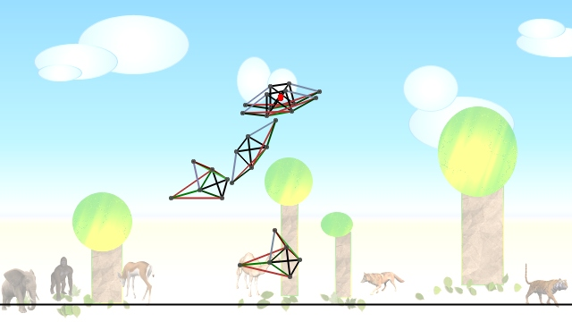



## EVOLVING Creatures \(update 3\)

### Description

EVOLVING CREATURES (Roberto Mior)

[Upadte 3]

- GA better Adaptive Mutation Prob

- Added Rotational Velocity for Input (2: >0 and <0)

- CyclesForScreenFrame 16->20

- Particle draw style

[Upadte 2]

- Smoothed point touching ground function (Sort of pressure)

- Smoothed Length Added by Brain

- Improved creature physics

- X Velocity Air Resistence

- Better management of tasks.

- Particle System

- Increased output links Excursion.

- CyclesForScreenFrame 12->16 CyclesForVideoFrame BrainClock

[Update 1]

- Very Faster

- Inputs/outputs Display

- SIN Function instead of EXP in NN Activation function

- Added Hidden layer with a number of neurons equal to 1.5 times the Number of Outputs

- 3 sons per Generation

- Better StayOnGround Fitness function

- Other 

----

This is a typical example of how evolution works.

A population of (customizable) Creatures try to Evolve according to some tasks.

A Creature is composed by springs and a neural network.

There are "intelligent" and "dumb" springs. First ones change their rest length according

to the neural network outputs. The other simply react to external forces to mantain their

invariable rest lengths.

The Creature's Neural Network Inputs are: "No-Brain" Springs Tensions, Points touching

ground, Creature Rotation (DX and DY), Height from ground, X and Y Velocities.

The Creature's Neural Network Outputs are: "Intelligent" springs rest lengths.

EVOLUTION (genetic algorithm):

At Each generation there are 3 sons wich parents are "randomly" choosen from the best

previous generation creatures. (Some sons mutate their genes with low probability (M)).

Then sons are Evaluated. (This 3 sons replace the previous generation worst creatures)

TASKS:

Creature's evaluation is based on Task(s) to perform.

These are:

WALK		(Distance walked)

DON'T JUMP	(Minimize avg height from ground)

AVG HEIGHT	(Average Creature middle point height)

MAX HEIGHT	(Creature Max Height Reached)

VERTICALITY *	(Rotate by -/+90°)

HORIZONTALITY *	(Keep initial orientation)[even 180°]

*(Rotation is based on the 2 (left-Right) most external links.)

These task can be mixed together. (for some complex tasks/creatures it's a little bit

diffcult to find the best proportions)

Each Creature performs a score (called "fitness")

VIDEOS:

http://www.youtube.com/playlist?p=PL52307
 
### More Info
 

             |
---                |---
**Submitted On**   |2011-07-17 12:47:20
**By**             |[reexre](https://github.com/Planet-Source-Code/PSCIndex/blob/master/ByAuthor/reexre.md)
**Level**          |Intermediate
**User Rating**    |5.0 (35 globes from 7 users)
**Compatibility**  |VB 6\.0
**Category**       |[Miscellaneous](https://github.com/Planet-Source-Code/PSCIndex/blob/master/ByCategory/miscellaneous__1-1.md)
**World**          |[Visual Basic](https://github.com/Planet-Source-Code/PSCIndex/blob/master/ByWorld/visual-basic.md)
**Archive File**   |[EVOLVING\_C220927892011\.zip](https://github.com/Planet-Source-Code/reexre-evolving-creatures-update-3__1-73944/archive/master.zip)

